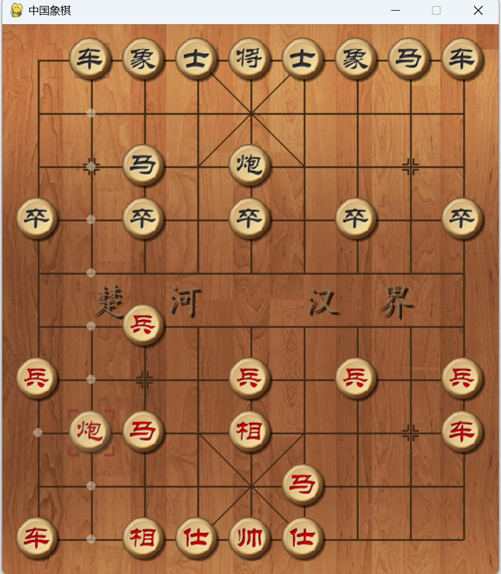
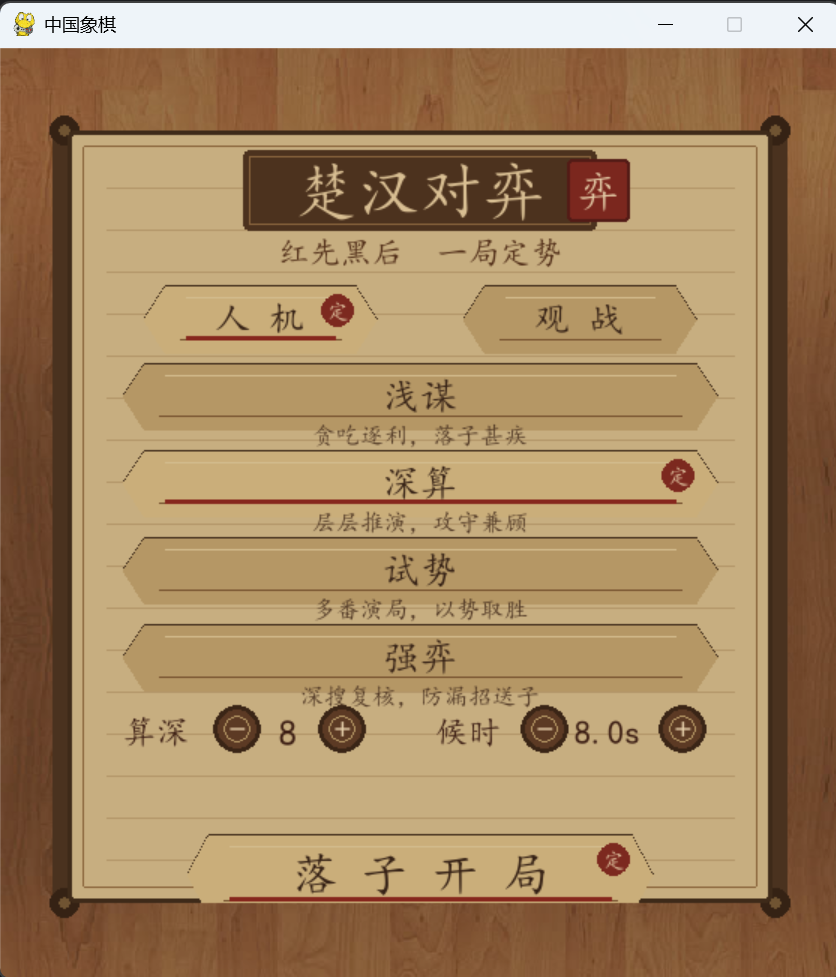
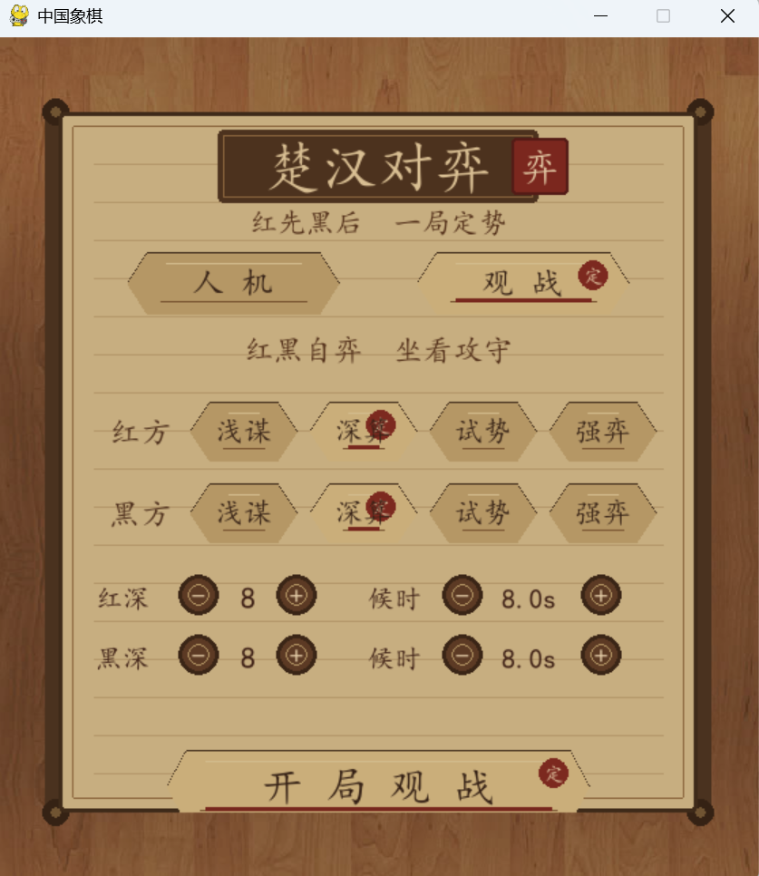

# XiangqiAI

一个基于 Python 与 Pygame 实现的中国象棋 AI 对弈项目。本项目实现了中国象棋的基本规则引擎、图形化交互界面，并尝试使用 Minimax、Alpha-Beta 剪枝与蒙特卡洛树搜索（MCTS）等算法实现棋类 AI。


---

## 1. 项目背景

中国象棋是一个规则复杂、状态空间巨大的双人零和博弈。相比五子棋、井字棋等简单棋类，中国象棋包含更多具有特殊约束的棋子规则，例如“马腿”“象眼”“炮隔子吃子”“将帅照面”等。

本项目选择中国象棋作为实践对象，主要目标是：

* 使用二维数组对棋盘状态进行建模；
* 实现不同棋子的合法走法生成；
* 实现将军、将帅照面等局面合法性判断；
* 使用搜索算法实现 AI 对弈；
* 进一步探索 MCTS 与神经网络自我对弈训练。


---

## 2. 页面功能介绍
### 菜单界面
#### 人机对弈
* 浅谋：贪心ai，完全是看棋就吃（跟它对决很容易没马）
* 深算：基础minimax，目前算力算是比较可以，也是最稳定的选择。可以选择算深，也就是minimax的深度；算时，也就是思考最多时间，如果超过时间未达到深度就会截断搜索（启用了静态评估），但一般而言完整搜完3层需要5s
* 试势：蒙特卡洛方法，需要先训练网络，但训练效果不佳，本人训练四天四夜才勉强与一层minimax匹敌，日后会进行改进
* 强弈：将minimax结合神经网络进行改良,，并加入一些低级错误检测，可能效果略微好于深算


#### ai对弈
+ 可以选择两个ai进行对弈，进行观战


### 功能
目前项目已经实现或尝试实现以下功能：

* 中国象棋棋盘显示；
* 棋子图片与字体资源加载；
* 玩家点击走棋；
* 基本合法走法判断；
* 车、马、炮、兵、将、士、象等棋子的移动规则；
* 将军检测；
* 将帅照面检测；
* 基于局面评估函数的 AI 走棋；
* Minimax 搜索；
* Alpha-Beta 剪枝优化；
* 蒙特卡洛树搜索（MCTS）；
* 神经网络训练框架的初步尝试。


其中，神经网络训练结果较大，模型权重文件未上传至 GitHub。

---

## 3. 项目结构

```text
XiangqiAI/
├── README.md
├── .gitignore
├── .gitattributes
├── LICENSE
├── main.py              # 项目入口，启动图形界面
├── board.py             # 棋盘状态与基础操作
├── rules.py             # 中国象棋规则与合法走法判断
├── ui.py                # Pygame 图形界面
├── sound.py             # 音效管理
├── ai.py                # 搜索 AI 与局面评估
├── alpha_mcts.py        # 蒙特卡洛树搜索 / AlphaZero 风格 MCTS 尝试
├── network.py           # 神经网络模型结构
├── Train.py             # 神经网络训练脚本
├── eval_strength.py     # AI 强度评估脚本
├── fonts/               # 字体资源
├── images/              # 棋盘与棋子图片资源
├── sounds/              # 音效资源
├── screenshots/         #部分截图 
└── 趣事or进展/           # 有趣记录
```

---

## 4. 核心算法

### 4.1 棋盘状态表示

项目使用二维列表表示 10 × 9 的中国象棋棋盘。棋盘中每个位置存储当前格点上的棋子信息，包括棋子类型与阵营。

这一部分对应课程中的数组、二维数组、状态表示与状态更新等知识点。

---

### 4.2 合法走法生成

不同棋子的走法规则不同，程序分别实现了各类棋子的合法走法生成逻辑：

* 车：沿横向或纵向扫描，直到遇到阻挡；
* 马：按照“日”字移动，并判断是否存在蹩马腿；
* 炮：普通移动时类似车，吃子时必须隔一个棋子；
* 象：按照“田”字移动，判断象眼，并限制不能过河；
* 士：限制在九宫内斜向移动；
* 将：限制在九宫内移动，并处理将帅照面；
* 兵：过河前只能前进，过河后可以左右移动。

这一部分主要涉及枚举、边界判断、方向数组、状态约束与规则建模。

---

### 4.3 将军检测与局面合法性判断

为了判断一步棋是否合法，程序不仅要判断棋子本身是否能移动到目标位置，还需要判断移动后己方将是否处于被攻击状态。

项目通过枚举对方棋子的攻击位置，判断当前局面是否构成将军或非法状态。

这一部分体现了搜索、状态模拟和合法性检测等

---

### 4.4 Minimax 博弈树搜索

中国象棋可以视为一个双人零和博弈。当前玩家希望最大化己方局面评分，对手则希望最小化该评分。

项目使用 Minimax 思想，在有限搜索深度内递归枚举可能走法，并根据评估函数选择较优走法。

这一部分对应递归、深度优先搜索、博弈树建模等课程知识点。

---

### 4.5 Alpha-Beta 剪枝

在普通 Minimax 搜索中，分支数较大，搜索效率较低。项目进一步使用 Alpha-Beta 剪枝维护当前搜索过程中的上下界，提前舍弃不可能影响最终决策的分支。

Alpha-Beta 剪枝可以在不改变最终搜索结果的前提下减少搜索节点数量，提高搜索效率。

这一部分体现了搜索优化与剪枝思想。

---

### 4.6 局面评估函数

由于中国象棋状态空间巨大，程序无法完整搜索到终局。因此在限定深度处使用启发式评估函数估计当前局面优劣。

评估函数可以综合考虑：

* 棋子价值；
* 棋子机动性；
* 兵是否过河；
* 将帅安全性；
* 棋子位置价值。

这一部分体现了启发式搜索和权重评分思想。

---

### 4.7 蒙特卡洛树搜索（MCTS）

项目尝试实现蒙特卡洛树搜索。MCTS 通过选择、扩展、模拟和反向传播四个阶段，在巨大状态空间中近似寻找较优走法。

MCTS 部分主要涉及树结构、随机模拟、UCB 选择策略和统计估计等内容。

---

## 5. 运行环境

建议使用 Python 3.10 或以上版本。

安装依赖：

```bash
pip install -r requirements.txt
```

主要依赖包括：

```text
pygame
numpy
torch
tqdm
tensorboard
```

如果只运行基础图形界面和搜索 AI，可能不需要安装完整的深度学习相关依赖。

---

## 6. 运行方法

启动游戏：

```bash
python main.py
```

如需运行训练：

```bash
python Train.py
```


---

## 7. 文件说明与未上传内容

为了保持仓库简洁，本项目未上传以下训练产物：

* `.pt` / `.pth` 模型权重文件；
* TensorBoard 日志；
* `run/` 或 `runs/` 训练输出目录；
* Python 缓存文件；
* 虚拟环境文件夹。

这些文件属于运行过程中的中间产物，不影响项目源码阅读与基础功能运行。

---

## 8. 已知问题与未来改进

目前项目仍有以下可改进之处：

* 代码结构可以进一步模块化；
* UI 逻辑与规则逻辑可以进一步解耦；
* MCTS 搜索速度仍有优化空间；
* 神经网络自我对弈训练尚未完全成熟；
* 可增加更多单元测试覆盖特殊规则；


未来可以继续优化：

* 合法走法生成效率；
* Alpha-Beta 搜索中的走法排序；
* MCTS 的模拟策略；
* 神经网络推理批处理；
* 更完整的胜负与和棋判定。

---

## 9. AI 工具使用声明
本项目的ui界面贪心ai和基础的minimax和MCTS为独立完成，后续优化使用了chatgpt和codex对minimax和MCTS进行了代码优化（成功由1000行优化到了2000行），ai辅助进行代码结构建议、调试思路分析、README 文档组织和算法解释整理。项目的核心规则逻辑均经过本人修改、测试和人工 Review。
AI 工具主要用于辅助表达、整理思路和排查问题，项目主体实现与最终提交内容由本人负责。

---

## 10. License

本项目采用 MIT License。

